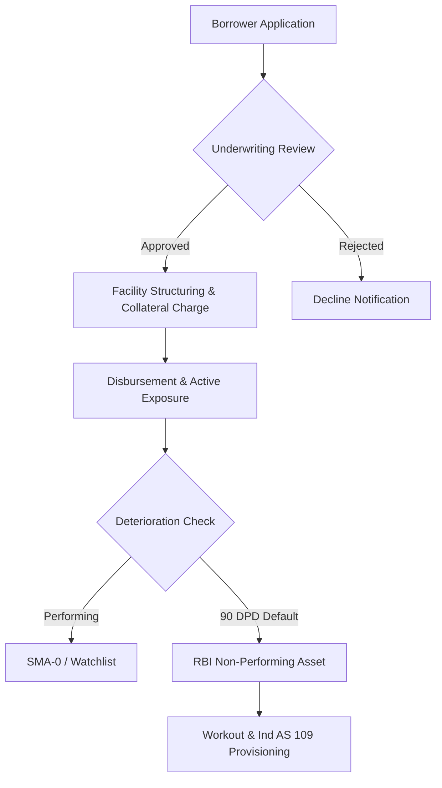

## Technical Reading Engine Verification

This test document verifies the Phase 2 rendering capabilities of the Primer engine.

### Math Notation

Here is an inline equation: $E = mc^2$ and the lifetime loss probability $P(T \le t) = 1 - e^{-\lambda t}$.

Below is a long display equation carrying the Basel Internal Ratings-Based (IRB) Risk-Weighted Asset capital requirement formula:

$$
K = \left[ LGD \times N\left( \frac{G(PD) + \sqrt{\rho} \times G(0.999)}{\sqrt{1 - \rho}} \right) - LGD \times PD \right] \times \frac{1 + (M - 2.5) \times b}{1 - 1.5 \times b}
$$

$$
\text{ECL} = \sum_{t=1}^{T} \frac{\text{PD}_t \times \text{LGD}_t \times \text{EAD}_t}{(1 + r)^t}
$$

### Process Flow Diagram



### Syntax Highlighting (Shiki)

```python
def calculate_expected_credit_loss(ead: float, pd: float, lgd: float, discount_rate: float, years: int) -> float:
    """Calculates discounted lifetime expected credit loss (ECL)."""
    total_ecl = 0.0
    for t in range(1, years + 1):
        marginal_pd = pd * ((1 - pd) ** (t - 1))
        discounted_loss = (marginal_pd * lgd * ead) / ((1 + discount_rate) ** t)
        total_ecl += discounted_loss
    return total_ecl
```

### Wide Reference Table

| Rating | PD (%) | LGD (%) | EAD ($M) | RW (%) | Stage 1 ($) | Stage 2 ($) | Stage 3 ($) | Provision ($) | Capital ($) |
| :--- | :--- | :--- | :--- | :--- | :--- | :--- | :--- | :--- | :--- |
| AAA | 0.03% | 45.0% | 150.0 | 20% | 20,250 | 0 | 0 | 20,250 | 1,350,000 |
| AA | 0.10% | 45.0% | 100.0 | 30% | 45,000 | 0 | 0 | 45,000 | 1,350,000 |
| A | 0.25% | 45.0% | 85.0 | 50% | 95,625 | 0 | 0 | 95,625 | 1,912,500 |
| BBB | 0.75% | 45.0% | 60.0 | 75% | 202,500 | 0 | 0 | 202,500 | 2,025,000 |
| BB | 2.50% | 50.0% | 40.0 | 100% | 0 | 500,000 | 0 | 500,000 | 2,000,000 |
| B | 6.00% | 55.0% | 25.0 | 150% | 0 | 825,000 | 0 | 825,000 | 2,250,000 |
| CCC | 15.00% | 65.0% | 10.0 | 250% | 0 | 0 | 975,000 | 975,000 | 1,625,000 |
