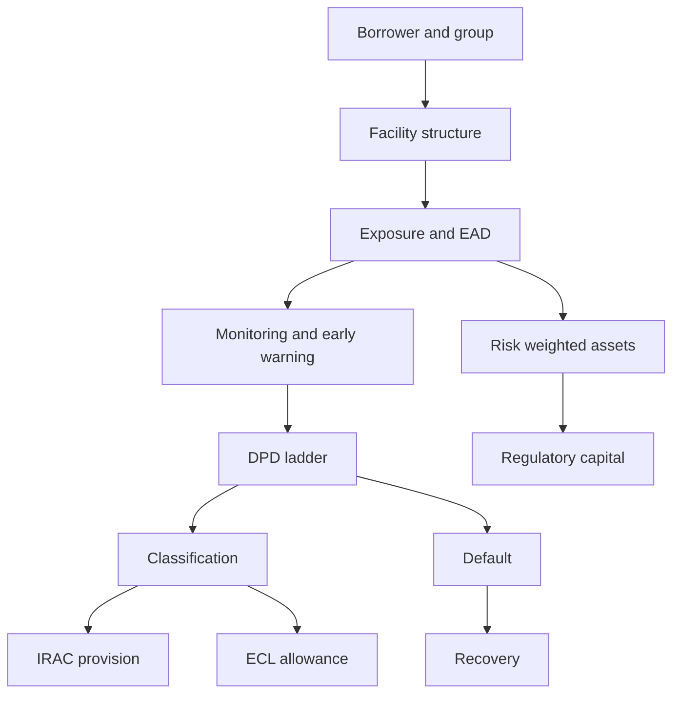
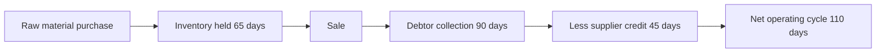
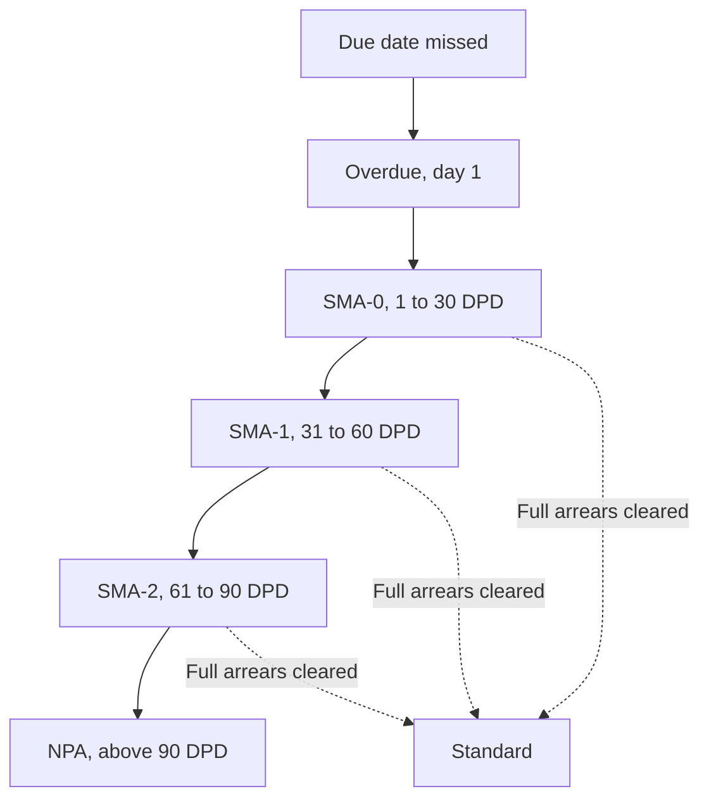
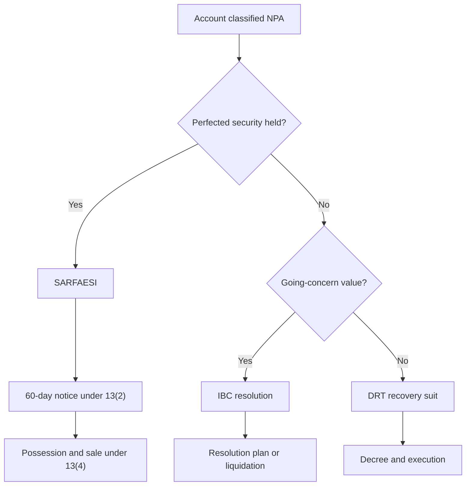

Indian lens: RBI IRAC norms, Basel III as adopted by RBI, Ind AS 109, SARFAESI and IBC.



:::permanent-rule
Credit risk is asymmetric. Upside is a capped spread; downside is the full principal. Every practice in lending follows from that.
:::

---

## 1. The loss equation

$$EL = PD \times LGD \times EAD$$

| Symbol | Meaning |
|---|---|
| $PD$ | Probability of default over the stated horizon |
| $LGD$ | Loss given default, fraction of EAD not recovered |
| $EAD$ | Exposure at default, in currency |

```
Worked
PD    3%
LGD   45%
EAD   INR 2,00,00,000

3% x 45% x 2,00,00,000 = INR 2,70,000
```

| Component | Driven by | Managed at | Changed by |
|---|---|---|---|
| PD | Borrower cash flow, behaviour | Underwriting | Selection, monitoring |
| LGD | Security, charge rank, enforceability | Documentation | Collateral, perfection, seniority |
| EAD | Facility type, undrawn limit | Structuring | Limit control, CCF, cancellation |

:::never-confuse
::left[Default]
A payment event. The borrower did not pay when due. Measured by PD.

::right[Loss]
A recovery outcome. What remained unrecovered after enforcement. Measured by LGD.
:::

A borrower who defaults and repays fully in the workout is a high PD event with near-zero loss. A borrower who never misses a date but forces a settlement at 70 paise is a zero PD event with high loss.

```flashcard
Q: What are the three components of expected loss and where is each managed?
A: PD at underwriting, LGD at documentation, EAD at structuring.
```

```flashcard
Q: Can a borrower cause a large credit loss without ever defaulting?
A: Yes. A negotiated settlement below full dues produces loss with no default event.
```

## 2. Borrower object model

| Object | Answers | Level |
|---|---|---|
| Customer | Do we know this person or entity | Identity |
| Borrower / obligor | Who owes and who is sued | Legal |
| Group / connected counterparty | Total bet on one source of cash | Aggregation |
| Account | Is this overdue today | Operational |
| Facility | What was sanctioned, what may be drawn | Contractual |

:::mental-model
Risk aggregates upward to the group. Obligation attaches downward to one legal person. Exposure is measured where the cash comes from; enforcement happens against whoever signed.
:::

```flashcard
Q: Why must a system hold obligor and group as separate objects?
A: A healthy obligor can sit inside a distressed group. The lending decision is impossible unless the two levels are held apart.
```

## 3. Exposure quantities

| Quantity | Definition | Used for |
|---|---|---|
| Sanctioned limit | Approved ceiling | Governance |
| Drawing power | Permitted drawing this month after margins | Operational control |
| Outstanding | Owed today | Accounting, DPD |
| Undrawn commitment | Limit less outstanding | CCF, potential exposure |
| Contingent | Guarantees, LCs, acceptances | Off balance sheet |
| EAD | Drawn plus undrawn times CCF | Capital, expected loss |

$$EAD = \text{Drawn} + (\text{Undrawn} \times CCF)$$

```
Worked
Drawn      INR 3,10,00,000
Undrawn    INR   90,00,000
CCF                    20%

3,10,00,000 + (90,00,000 x 20%) = INR 3,28,00,000
```

:::key-insight
Undrawn limits are drawn precisely when the lender would least like it. A borrower heading for default takes everything available while it is still available. The regulatory CCF is a capital floor, not a forecast — observed EAD at default approaches the full limit.
:::

```flashcard
Q: Why is the outstanding balance the wrong exposure measure for a revolving facility?
A: The undrawn portion is drawn during deterioration. EAD at default approaches the sanctioned limit.
```

## 4. Segment machinery

| | Retail | MSME | Corporate |
|---|---|---|---|
| Unit of analysis | Person | Business | Credit |
| Decision | Rules engine, scorecard | Analyst plus unit visit | Committee plus rating |
| Turnaround | 1-3 days | 3-6 weeks | 2-4 months |
| Primary evidence | Bureau, salary credits, ITR | GST returns, bank statements, stock statement | Audited accounts, rating, sector view |
| Core test | Affordability — FOIR, LTV | Cash cycle viability | Debt service through the cycle |
| Security norm | Asset financed | Current assets, collateral, personal guarantee | Consortium package, covenants |
| Loss pattern | Frequent, small, forecastable | Lumpy, idiosyncratic | Rare, large, correlated |
| Modelling | Statistical, pooled | Hybrid | Judgemental, name by name |

Retail losses are statistical and can be priced. Corporate losses are events, and the next one may be twice the size of the last.

```flashcard
Q: Why can retail credit losses be priced but corporate losses cannot?
A: Retail defaults are near-independent and fall in a narrow band. Corporate defaults are correlated by sector and arrive together.
```

## 5. Credit information companies

Four CICs are registered under CICRA 2005: TransUnion CIBIL, Experian, Equifax, CRIF High Mark. Reporting to all four is mandatory, so tradeline content is substantially identical. Multiple pulls catch reporting gaps, not different data.

| Report carries | Report does not carry |
|---|---|
| Every reported credit account | Income |
| Month-by-month DPD string per account | Unreported borrowing — chit funds, moneylenders, family |
| Limits, balances, utilisation | Business cash flow |
| Enquiry count and enquirer type | Intent |
| Written-off and settled flags | Wilful defaulter status, held separately |

:::trap
The enquiry count is a leading indicator and is routinely ignored. Four enquiries in six months means three declines or loan stacking. It is visible before any delinquency exists, and it is skipped because the score looks acceptable.
:::

```flashcard
Q: What can a bureau report never tell an underwriter?
A: Income, business cash flow, and any borrowing not reported to the CICs.
```

## 6. Cash versus profit

$$\text{Cash generated} = PAT + \text{Depreciation} - \Delta \text{Debtors} - \Delta \text{Stock} + \Delta \text{Creditors}$$

```
Worked
PAT              INR 96,00,000
Depreciation     INR 22,00,000
Change in debtors      +70,00,000
Change in stock        +40,00,000
Change in creditors    +25,00,000

96 + 22 - 70 - 40 + 25 = INR 33,00,000
```



Growth in a working capital business consumes cash. Faster growth consumes it faster, which is why the most dangerous MSME account is often the one growing fastest.

```flashcard
Q: Why can a profitable business fail to pay an instalment?
A: Profit sits in stock and receivables. Only collected cash services debt.
```

## 7. Ratios — what each answers and when it misleads

| Ratio | Formula | Question | Comfort | Misleads when |
|---|---|---|---|---|
| Debt / equity | Total debt / net worth | How geared | Under 2.0 | Net worth inflated by revaluation |
| Debt / EBITDA | Total debt / EBITDA | Years to repay | Under 3.5 | EBITDA carries one-off income |
| Interest coverage | EBITDA / interest | Can it pay interest | Above 2.0 | Interest capitalised, not expensed |
| DSCR | Cash available / debt service | Can it service debt | Above 1.25 | Principal understated by refinancing |
| Current ratio | Current assets / current liabilities | Short-term solvency | Above 1.33 | Stock unsaleable, debtors uncollectable |
| Quick ratio | Current assets less stock / CL | Solvency without selling stock | Above 1.0 | Debtors stale |
| Inventory days | Stock / COGS x 365 | Cycle length | Sector-specific | Stock overstated |
| Debtor days | Debtors / sales x 365 | Collection quality | Sector-specific | Ageing hidden in the gross figure |

$$DSCR = \frac{EBITDA}{\text{Interest} + \text{Principal due}}$$

```
Worked
EBITDA              INR 135 cr
Interest            INR  38 cr
Principal due       INR  55 cr

135 / (38 + 55) = 1.45
```

At 1.45 the borrower absorbs a 30% fall in EBITDA before it cannot pay. Leverage describes the position. Coverage predicts the default.

```flashcard
Q: Which ratio turns into a missed payment first, and why?
A: DSCR. It measures whether cash covers debt service, which is the event itself.
```

## 8. Facility families

| Family | Repayment mechanic | Failure mode | EAD behaviour |
|---|---|---|---|
| Amortising term | Scheduled principal and interest | Income or cash flow shock | Falls with age |
| Bullet / demand | Single repayment at maturity | Refinancing unavailable on the day | Full principal throughout |
| Revolving — CC, OD | Renewed, rarely repaid | Cycle stops, limit fully drawn | Near full limit |
| Bill discounting | Self-liquidating on bill maturity | Drawee does not honour | Bill value |
| Project finance | Sculpted to project cash flow | Completion or offtake failure | Draws then amortises |
| Contingent — BG, LC | Nothing paid unless invoked | Invocation converts it to a funded loan | Zero until 100% |
| Guarantee-backed | Third party pays on default | Guarantor unenforceable | Full, less guarantee |

A cash credit is renewed annually and almost never repaid. The lender is exposed continuously, near the full limit, for the life of the relationship.

```flashcard
Q: What is distinctive about the EAD profile of a contingent facility?
A: Zero until invocation, then full, and invocation coincides with the borrower's inability to reimburse.
```

## 9. Drawing power

$$DP = \big(S_{paid} \times (1 - m_s)\big) + \big(D_{elig} \times (1 - m_d)\big)$$

| Symbol | Meaning |
|---|---|
| $S_{paid}$ | Stock less creditors — the portion not already supplier-funded |
| $m_s$ | Stock margin |
| $D_{elig}$ | Debtors within the ageing cut-off, commonly 90 days |
| $m_d$ | Debtor margin |

```
Worked
Stock                     INR 5,20,00,000
less creditors            INR 2,40,00,000
Paid stock                INR 2,80,00,000
less 25% margin           INR   70,00,000
Eligible on stock         INR 2,10,00,000

Debtors under 90 days     INR 3,10,00,000
less 40% margin           INR 1,24,00,000
Eligible on debtors       INR 1,86,00,000

Drawing power             INR 3,96,00,000
Sanctioned limit          INR 4,00,00,000
Permitted drawing         INR 3,96,00,000    lower of DP and limit
```

:::trap
The stock statement is self-reported and is the most manipulated document in MSME lending. Overstated stock and aged debtors shown as current raise drawing power directly. Late submission or round-figure submission is itself the signal.
:::

```flashcard
Q: Why are creditors deducted before applying the stock margin?
A: That portion of stock is already funded by suppliers. Funding it again would double-finance the same asset.
```

## 10. Security types

| Type | Example | Behaviour on default | LGD effect |
|---|---|---|---|
| Immovable, residential | Self-occupied property | Retains value, slow to enforce | Strong |
| Immovable, industrial | Factory land and building | Distress discount, illiquid | Moderate |
| Plant and machinery | Specialised equipment | Heavy discount, buyer-specific | Weak to moderate |
| Current assets | Stock, book debts | Evaporates as the business closes | Weak |
| Financial | Fixed deposit, securities, gold | Realisable immediately | Strongest |
| Personal guarantee | Promoter | Only as good as assets held in own name | Variable to nil |
| Corporate guarantee | Group company | Correlated with the borrower | Weak |

Security sets LGD, not PD. Current-asset security is worth most when it is least needed: a running factory's inventory has value, a closed one's does not.

```flashcard
Q: Does taking collateral reduce the probability of default?
A: Barely. It sets loss given default. Any PD effect is behavioural and small.
```

## 11. Charge creation versus perfection

:::never-confuse
::left[Creation]
The agreement. The hypothecation deed or mortgage the borrower signed. Binds the borrower.

::right[Perfection]
The public registration. Makes the charge good against all other creditors. Without it the lender is unsecured at enforcement.
:::

| Security | Instrument | Registry | Timeline |
|---|---|---|---|
| Company assets | Hypothecation or mortgage deed | ROC, Companies Act 2013 | Generally 30 days from creation |
| Immovable property | Mortgage | CERSAI | On creation |
| Equitable mortgage | Deposit of title deeds | CERSAI, memorandum of entry | On deposit |
| Movable assets | Hypothecation | ROC where the borrower is a company | 30 days |
| Financial assets | Pledge, lien marking | Depository or issuer | On marking |

Adjacent failures with the same effect: stale valuation, unregistered modification of charge, and a guarantee from a guarantor holding nothing in his own name.

```flashcard
Q: What is the practical consequence of a charge that was created but never registered?
A: The lender ranks as an unsecured creditor. A loan underwritten at 30% LGD becomes a 75% LGD loan, discovered only at enforcement.
```

## 12. Charge ranking

| Position | Claim | Recovery in a shortfall |
|---|---|---|
| First charge, exclusive | Senior, sole | Full realisation up to dues |
| First charge, pari passu | Senior, shared rateably | Proportionate share |
| Second charge | Residual after first charge dues | Usually nil |
| Unsecured | No charge | Pro rata with trade creditors |
| Subordinated | Contractually junior | Last |

```
Realisation                         INR 120 cr
First charge dues, pari passu       INR 150 cr
Our share of first charge           INR  55 cr

First charge, pari passu
120 x (55 / 150) = INR 44 cr recovered      LGD 20%

Second charge behind INR 150 cr
INR 0 recovered                             LGD 100%
```

:::never-confuse
::left[Security value]
What the assets would realise. A quantity.

::right[Security position]
Where the lender stands in the queue for that realisation. A rank.
:::

Asset cover of INR 200 crore behind a INR 55 crore loan is meaningless if the lender sits behind INR 190 crore of first charge.

```flashcard
Q: Same borrower, same assets, same default — what makes the difference between 20% and 100% LGD?
A: Charge rank. One line in the sanction letter.
```

## 13. Covenants

| Type | Example | Purpose |
|---|---|---|
| Financial | DSCR above 1.25, debt/EBITDA under 3.5 | Trigger for renegotiation before default |
| Information | Quarterly financials within 45 days, monthly stock statement | Makes financial covenants testable in time |
| Affirmative | Maintain insurance, maintain security cover ratio | Preserve LGD |
| Negative | No further borrowing, no asset disposal, dividend cap | Prevent value leakage |
| Cross-default | Default with any lender triggers default here | Prevents selective servicing |

A covenant recovers nothing. Its value is the defined moment at which the lender may act — months before any payment is missed.

:::trap
The serial waiver. A covenant breached and waived once is a judgement. Breached and waived four quarters running, the covenant has been repriced to zero and the borrower has learnt the number is decorative. Every large restructuring has a run of quiet waivers in front of it.
:::

```flashcard
Q: What does a financial covenant actually protect?
A: Nothing. It creates a contractual right to intervene early. The information covenant is what makes it usable.
```

## 14. Early warning signals

| Signal | Segment | Indicates |
|---|---|---|
| Salary credit stops or halves | Retail | Income loss, weeks before the first missed EMI |
| CC utilisation above 95% continuously | MSME, corporate | Limit funding losses, not the cycle |
| Cheque returns, any size | All | Liquidity stress |
| Credits into the account falling | MSME | Turnover falling or routed elsewhere |
| Stock statement late or in round figures | MSME | Statement being constructed |
| GST returns filed late | MSME | Administrative or cash breakdown |
| New borrowing appearing on bureau | All | Stacking, refinancing pressure |
| Promoter share pledge rising | Corporate | Promoter liquidity stress |
| Auditor resignation, delayed results | Corporate | Accounting problem |
| Rating downgrade or outlook change | Corporate | External confirmation, usually late |

:::key-insight
Behaviour deteriorates before financials, and financials deteriorate before payments. Account behaviour is monthly and real-time; financials are annual and audited. A lender reading only financials is reading its slowest signal.
:::

```flashcard
Q: In what order do the three classes of deterioration signal appear?
A: Account behaviour first, financials second, missed payments last.
```

## 15. DPD ladder and SMA



| Rule | Position |
|---|---|
| DPD counting | Continuous, at day end |
| Reset | Only on clearance of the entire arrears |
| Part payment | Does not reset the clock |
| CC and OD trigger | Out of order continuously beyond 90 days — outstanding above DP, or credits insufficient to cover interest |
| Bills purchased or discounted | Overdue beyond 90 days |
| Upgradation to standard | Only on repayment of the entire arrears of interest and principal |

:::trap
The month-end top-up. Funds are deposited before the reporting date and withdrawn after it. The clock resets, the account is standard on every reporting date, and it has not been serviced from business cash for a year. Visible in the account statement, invisible in the classification report.
:::

```flashcard
Q: A borrower pays half the arrears on day 85. What is his DPD on day 91?
A: 91. Part payment does not reset the clock; only clearance of the entire arrears does.
```

```flashcard
Q: How does a cash credit account become an NPA when there is no instalment to miss?
A: By remaining out of order continuously beyond 90 days — outstanding above drawing power, or credits insufficient to cover interest.
```

## 16. NPA classification

| Class | Condition | Period |
|---|---|---|
| Standard | Not NPA, no arrears beyond 90 days | — |
| Sub-standard | NPA | First 12 months as NPA |
| Doubtful 1 | Remained sub-standard | Up to 1 year in doubtful |
| Doubtful 2 | Remained doubtful | 1 to 3 years in doubtful |
| Doubtful 3 | Remained doubtful | Above 3 years |
| Loss | Loss identified by bank, auditor or inspection, not yet written off | Any |

Classification is borrower-wise, not facility-wise. All facilities of a borrower classify together.

```flashcard
Q: One of a borrower's four facilities crosses 90 DPD. What classifies?
A: All four. Classification is borrower-wise.
```

## 17. IRAC provisioning rates

| Asset class | Portion | Rate |
|---|---|---|
| Standard, general | — | 0.40% |
| Standard, direct agriculture and SME | — | 0.25% |
| Standard, commercial real estate | — | 1.00% |
| Standard, CRE residential housing | — | 0.75% |
| Sub-standard | Secured | 15% |
| Sub-standard | Unsecured ab initio | 25% |
| Doubtful 1 | Secured | 25% |
| Doubtful 2 | Secured | 40% |
| Doubtful 3 | Secured | 100% |
| Doubtful, any age | Unsecured | 100% |
| Loss | Entire | 100% |

```
Provision on classification

Outstanding, secured         INR 3,10,00,000
Sub-standard rate                        15%

3,10,00,000 x 15% = INR 46,50,000 in the quarter of classification
```

Rates require verification against the current Master Circular.

```flashcard
Q: What is the provisioning rate on a secured sub-standard asset, and how does it change as it ages?
A: 15% at sub-standard, then 25%, 40% and 100% through the doubtful bands.
```

## 18. Income recognition on NPA

| Rule | Effect |
|---|---|
| Interest accrual | Not recognised in P&L unless actually realised |
| Unrealised interest credited in earlier periods | Reversed |
| Fees, commission and similar income | Same treatment |
| Recovery appropriation | Per bank policy, consistently applied, or per court order |
| Partly recovered accounts | Income only to the extent realised |

Classification does three things at once: classifies, provides, and stops income — including returning income already booked in earlier periods.

```flashcard
Q: Beyond the provision, what second hit does classification impose on the P&L?
A: Reversal of unrealised interest already recognised in prior periods.
```

## 19. Restructuring versus evergreening

| | Restructuring | Evergreening |
|---|---|---|
| What changes | Tenor, instalment, rate, moratorium | Nothing; a new limit funds old interest |
| Viability | Assessed and documented | Not assessed |
| Classification | Downgraded or flagged per the resolution framework | Kept standard |
| Provision | Recognised | Avoided |
| Exposure | Stable or reduced | Grows |
| Tell | Documented plan, promoter contribution | Fresh disbursement roughly equals interest due |

Restructuring a viable business with a wrong repayment schedule is correct practice. Evergreening converts a recognisable problem into an unrecognisable and larger one.

:::key-insight
The evergreening tell is arithmetic, not judgement. If new disbursement in and interest servicing out are approximately the same number, nothing is being repaid.
:::

```flashcard
Q: What single test distinguishes evergreening from restructuring?
A: Whether the borrower is servicing debt from business cash or from freshly sanctioned limits.
```

## 20. Expected credit loss — Ind AS 109

### Staging

| | Stage 1 | Stage 2 | Stage 3 |
|---|---|---|---|
| Trigger | Origination, no significant increase in credit risk | Significant increase in credit risk since origination | Credit-impaired, default |
| Loss allowance | 12-month ECL | Lifetime ECL | Lifetime ECL |
| Interest recognised on | Gross carrying amount | Gross carrying amount | Net carrying amount |
| DPD anchor | 0-30 | 30-90 | Above 90 |

Stage movement is symmetric. An account that improves moves back, which is the sharpest structural difference from IRAC, where upgradation requires full clearance of arrears.

### The measurement

$$ECL = \sum_{t=1}^{T} \frac{PD_t^{\,marg} \times LGD_t \times EAD_t}{(1 + EIR)^{\,t}}$$

| Symbol | Meaning |
|---|---|
| $T$ | 12 months for Stage 1, remaining life for Stages 2 and 3 |
| $PD_t^{\,marg}$ | Marginal probability of defaulting in period $t$, having survived to $t-1$ |
| $LGD_t$ | Loss given default applicable in period $t$ |
| $EAD_t$ | Expected exposure at the start of period $t$ |
| $EIR$ | Original effective interest rate, used for discounting |

The marginal PD is not the cumulative PD. It is the conditional default probability weighted by survival:

$$PD_t^{\,marg} = \left( \prod_{i=1}^{t-1} \left(1 - PD_i\right) \right) \times PD_t$$

```
12-month ECL, single period

PD 12m                 2.0%
LGD                     40%
EAD          INR 1,00,00,000
Discount factor        0.96

2.0% x 40% x 1,00,00,000 x 0.96 = INR 76,800
```

```
Lifetime ECL, three periods

Year   PD cond.   Survival   PD marginal   LGD    EAD          DF      ECL
1        2.0%      1.000        2.00%      40%   1,00,00,000   0.94   75,200
2        3.0%      0.980        2.94%      40%     70,00,000   0.88   72,442
3        4.0%      0.951        3.80%      40%     40,00,000   0.83   50,464

Lifetime ECL = INR 1,98,106
```

The EAD column falls because the instrument amortises. On a revolving facility it does not fall, which is the hardest part of ECL in practice.

### What makes ECL difficult

| Problem | Why it is hard |
|---|---|
| PD term structure | A single 12-month PD is insufficient; lifetime requires a curve by period |
| Revolving exposures | No contractual maturity, so lifetime must be estimated behaviourally |
| Forward-looking input | Macroeconomic scenarios, probability-weighted, each producing a different PD curve |
| SICR definition | Relative deterioration since origination, not an absolute level — requires origination-date data |
| Discounting | At the original EIR, not a current rate |

| Concept | Position |
|---|---|
| SICR | Rebuttable presumption of significant increase at 30 DPD |
| Default | Rebuttable presumption at 90 DPD |
| POCI | Purchased or originated credit-impaired, always lifetime ECL |
| Modification | May or may not derecognise the asset; affects staging either way |

### ECL against IRAC

| | IRAC | ECL |
|---|---|---|
| Basis | Rule, ageing-driven | Model, expectation-driven |
| Direction | Backward-looking | Forward-looking |
| Standard asset | Flat general provision | Computed 12-month ECL |
| Movement back | Only on full clearance of arrears | Symmetric, on improvement |
| Judgement | Minimal | Substantial — staging, scenarios, LGD |
| Set by | RBI | The entity, audited |

:::never-confuse
::left[IRAC provision]
Provides for deterioration that has already occurred. A rule applied to an ageing bucket.

::right[ECL allowance]
Provides for loss expected in the future, from day one of a performing loan. A model output.
:::

Applicability: NBFCs and HFCs in India report under Ind AS. RBI has deferred Ind AS implementation for banks; banks continue on IRAC. Confirm the current position before relying on it.

```flashcard
Q: What distinguishes 12-month ECL from lifetime ECL?
A: The measurement horizon only. Twelve-month ECL is lifetime loss from defaults occurring in the next twelve months, not loss over the next twelve months.
```

```flashcard
Q: Why is marginal PD used rather than cumulative PD in the lifetime ECL sum?
A: Each period's loss must be weighted by the probability of surviving to that period and defaulting in it, otherwise defaults are double counted.
```

```flashcard
Q: At what rate is ECL discounted?
A: The original effective interest rate of the instrument, not a current market rate.
```

```flashcard
Q: Which exposure class is hardest to measure lifetime ECL on, and why?
A: Revolving facilities. They have no contractual maturity, so both the horizon and the future EAD must be estimated behaviourally.
```

## 21. Basel — capital for credit risk

Three pillars: minimum capital requirements, supervisory review through ICAAP and SREP, and market discipline through disclosure.

$$RWA = EAD \times \text{Risk weight} \qquad CRAR = \frac{\text{Eligible capital}}{RWA_{credit} + RWA_{market} + RWA_{operational}}$$

### The three approaches

| Approach | PD | LGD | EAD | Risk weight from |
|---|---|---|---|---|
| Standardised | Not used | Not used | Regulatory CCF | External rating grid |
| Foundation IRB | Bank estimate | Regulatory | Regulatory | Supervisory formula |
| Advanced IRB | Bank estimate | Bank estimate | Bank estimate | Supervisory formula |

Indian banks operate the standardised approach for credit risk. IRB requires prior RBI approval.

### The IRB capital function

Under IRB the risk weight is not read from a grid — it is computed. Capital is held against the loss at the 99.9th percentile of the loss distribution, less the expected loss already covered by provisions.

$$K = \left[ LGD \cdot N\!\left( \frac{N^{-1}(PD) + \sqrt{R}\,\, N^{-1}(0.999)}{\sqrt{1-R}} \right) - PD \cdot LGD \right] \cdot \frac{1 + (M - 2.5)\,b}{1 - 1.5\,b}$$

| Symbol | Meaning |
|---|---|
| $K$ | Capital requirement per unit of exposure |
| $N(\cdot)$ | Standard normal cumulative distribution function |
| $N^{-1}(\cdot)$ | Inverse standard normal, the quantile function |
| $R$ | Asset correlation with the single systematic factor |
| $M$ | Effective maturity in years |
| $b$ | Maturity adjustment |
| $0.999$ | Supervisory confidence level — a one-in-a-thousand year loss |

Correlation, for corporate, sovereign and bank exposures, falls as PD rises:

$$R = 0.12 \cdot \frac{1 - e^{-50\,PD}}{1 - e^{-50}} + 0.24 \cdot \left[ 1 - \frac{1 - e^{-50\,PD}}{1 - e^{-50}} \right]$$

Maturity adjustment:

$$b = \big(0.11852 - 0.05478 \cdot \ln(PD)\big)^2$$

Risk weighted assets:

$$RWA = K \times 12.5 \times EAD$$

The factor 12.5 is the reciprocal of the 8% minimum capital ratio, converting a capital requirement back into an asset equivalent.

| Correlation by exposure class | R |
|---|---|
| Corporate, sovereign, bank | 0.12 to 0.24, declining with PD |
| Residential mortgage | 0.15, fixed |
| Qualifying revolving retail | 0.04, fixed |
| Other retail | 0.03 to 0.16, declining with PD |
| SME size adjustment | Reduces R by up to 0.04 with turnover |

:::key-insight
The correlation term is where the economics sit. Mortgages carry a high fixed correlation because house prices move together across a whole economy. Qualifying revolving retail carries the lowest correlation of any class — card defaults are close to independent — which is why it consumes far less capital per rupee of expected loss than its default rate alone would suggest.
:::

### Standardised risk weights

| Exposure | Risk weight |
|---|---|
| Central and State Government | 0% |
| Corporate, AAA | 20% |
| Corporate, AA | 30% |
| Corporate, A | 50% |
| Corporate, BBB | 100% |
| Corporate, BB and below | 150% |
| Corporate, unrated | 100%, higher above specified exposure thresholds |
| Regulatory retail | 75% |
| Housing, by LTV band | 35% to 75% |
| Commercial real estate | 100% |
| CRE residential housing | 75% |
| Consumer credit, personal loans | 125% |
| Credit card receivables | 150% |
| NPA, unsecured portion, provision under 20% | 150% |
| NPA, unsecured portion, provision 20-50% | 100% |
| NPA, unsecured portion, provision above 50% | 50% |

### Minimum ratios in India

| Ratio | Minimum |
|---|---|
| Common Equity Tier 1 | 5.5% |
| Tier 1 | 7.0% |
| Total CRAR | 9.0% |
| Capital conservation buffer | 2.5% of CET1 |
| CRAR including CCB | 11.5% |
| Countercyclical buffer | 0 to 2.5%, activated by RBI |
| D-SIB surcharge | Bucket-dependent additional CET1 |
| Leverage ratio | 4.0% for D-SIBs, 3.5% for others |

```
Capital consumed, standardised

Unrated corporate
EAD                INR 3,28,00,000
Risk weight                   100%
RWA                INR 3,28,00,000
Capital at 11.5%   INR   37,72,000

Housing, LTV under 80%
Exposure           INR   35,00,000
Risk weight                    35%
RWA                INR   12,25,000
Capital at 11.5%   INR    1,40,875
```

Per rupee lent, the corporate exposure consumes roughly twenty-seven times the capital of the housing loan. That ratio, not the interest rate, explains the shape of Indian bank balance sheets.

Credit risk mitigation reduces RWA through eligible financial collateral, on-balance-sheet netting, guarantees and credit derivatives, subject to haircuts and minimum documentation standards.

:::permanent-rule
Provisions cover expected loss. Capital covers unexpected loss. Expected loss is a cost of business and is priced in; unexpected loss is what shareholders' funds exist to absorb.
:::

All risk weights and ratios require verification against the current Basel III Master Circular.

```flashcard
Q: What does the 0.999 term in the IRB capital function represent?
A: The supervisory confidence level — capital is held against a one-in-a-thousand-year loss outcome.
```

```flashcard
Q: Why is expected loss subtracted inside the IRB capital formula?
A: Expected loss is already covered by provisions. Capital is required only for the unexpected portion.
```

```flashcard
Q: Why does the IRB formula multiply K by 12.5?
A: To convert a capital requirement into a risk weighted asset equivalent — 12.5 is the reciprocal of the 8% minimum ratio.
```

```flashcard
Q: Which retail class carries the lowest asset correlation and what follows from it?
A: Qualifying revolving retail at 0.04. Low correlation means low capital per unit of expected loss.
```

## 22. Concentration

| Limit | Basis |
|---|---|
| Single counterparty | Percentage of eligible Tier 1 capital |
| Group of connected counterparties | Higher percentage of eligible Tier 1 capital |
| Sector | Internal board-approved limit |
| Geography | Internal board-approved limit |
| Aggregate substantial exposures | Internal ceiling |

Large Exposures Framework thresholds are set by RBI and revised. Verify.

:::mental-model
Diversification is the only free improvement in lending. Better underwriting costs money and takes years to show. Refusing to concentrate a quarter of the book in one sector costs nothing — and is the constraint most often waived while that sector is performing well.
:::

```flashcard
Q: Why do sector concentration limits get waived, and when?
A: While the sector is performing well. Concentration is only visibly expensive after the correlated losses arrive.
```

## 23. Recovery routes



| Route | Statute | Available to | Trigger | Practical duration |
|---|---|---|---|---|
| SARFAESI | SARFAESI Act 2002 | Secured creditors | Account classified NPA | 1-2 years |
| DRT | RDDBFI Act 1993 | Banks and FIs | Debt above the pecuniary threshold | 3-5 years |
| IBC | IBC 2016 | Financial and operational creditors | Default above threshold | Outer limit 330 days; realised longer |
| Compromise settlement | Board policy | All | Board-approved policy | Months |

SARFAESI is unavailable against agricultural land. IBC is resolution, not a recovery suit — control passes from the promoter on admission. Every month of delay costs recovery value: assets deteriorate and the borrower's incentive to cooperate falls once he concludes the business is lost.

Thresholds and timelines under all three have been revised repeatedly. Verify.

```flashcard
Q: What is the first question that determines the recovery route?
A: Whether perfected security is held. If yes, SARFAESI. If not, the choice is between IBC and a DRT suit.
```

## 24. Named failure modes

| Failure | Mechanism | Detected at |
|---|---|---|
| Lending against the balance sheet | Profit taken as repayment capacity | Never, until the instalment is missed |
| Unperfected charge | Registration missed, lender unsecured | Enforcement, when it cannot be fixed |
| Stale limit | Revolving limit renewed unchanged while the business changed shape | Renewal review, if performed |
| Serial covenant waiver | Trigger repriced to zero | Restructuring, in hindsight |
| Group treated as separate borrowers | True exposure double the recorded limit | Default of the first entity |
| Month-end window dressing | Clock reset without servicing | Account statement, not the classification report |
| Evergreening | New limit funds old interest | Disbursement pattern matching interest due |

---

## Every number

All figures require verification against the current RBI Master Circulars.

| Item | Value | Section |
|---|---|---|
| SMA-0 / SMA-1 / SMA-2 | 1-30 / 31-60 / 61-90 DPD | 15 |
| NPA | Above 90 DPD | 15 |
| Sub-standard period | First 12 months as NPA | 16 |
| Doubtful 1 / 2 / 3 | Up to 1 yr / 1-3 yrs / above 3 yrs | 16 |
| Standard provision, general | 0.40% | 17 |
| Standard, agriculture and SME | 0.25% | 17 |
| Standard, CRE | 1.00% | 17 |
| Standard, CRE-RH | 0.75% | 17 |
| Sub-standard, secured / unsecured | 15% / 25% | 17 |
| Doubtful secured, D1 / D2 / D3 | 25% / 40% / 100% | 17 |
| Doubtful unsecured, and Loss | 100% | 17 |
| SICR presumption | 30 DPD, rebuttable | 20 |
| Default presumption, Ind AS | 90 DPD, rebuttable | 20 |
| IRB confidence level | 99.9% | 21 |
| IRB correlation, corporate | 0.12 to 0.24 | 21 |
| IRB correlation, mortgage | 0.15 | 21 |
| IRB correlation, qualifying revolving retail | 0.04 | 21 |
| RWA multiplier | 12.5 | 21 |
| CET1 / Tier 1 / CRAR | 5.5% / 7.0% / 9.0% | 21 |
| CCB, and CRAR with CCB | 2.5%, 11.5% | 21 |
| Leverage ratio | 4.0% D-SIB, 3.5% others | 21 |
| RW corporate, AAA / AA / A / BBB / BB and below | 20 / 30 / 50 / 100 / 150% | 21 |
| RW unrated corporate | 100% | 21 |
| RW regulatory retail | 75% | 21 |
| RW housing, by LTV | 35% to 75% | 21 |
| RW consumer credit / credit card | 125% / 150% | 21 |
| CCF on undrawn, illustrative | 20% | 3 |
| Stock margin / debtor margin, illustrative | 25% / 40% | 9 |
| Debtor ageing cut-off for DP | 90 days | 9 |
| ROC charge registration | Generally 30 days | 11 |
| SARFAESI demand notice | 60 days | 23 |
| IBC statutory outer limit | 330 days | 23 |

## Never-confuse board

```
Default              != Loss
Provision            != Loss
Expected loss        != Unexpected loss
Sanctioned limit     != Drawing power != Outstanding != EAD
Security value       != Security position
Charge created       != Charge perfected
Restructuring        != Evergreening
IRAC provision       != ECL allowance
12-month ECL         != Loss over the next 12 months
Cumulative PD        != Marginal PD
Leverage             != Coverage
Obligor exposure     != Group exposure
Contingent exposure  != Nil exposure
Borrower-wise class  != Facility-wise class
```

## What must survive

Credit risk is asymmetric: capped upside, total downside.

Expected loss is PD times LGD times EAD. PD is underwriting, LGD is documentation, EAD is structuring.

Risk aggregates upward to the group; obligation attaches downward to one legal person.

Undrawn limits are drawn precisely when the lender would least like it.

Coverage predicts default; leverage only describes the position.

Collateral sets LGD, not PD. An unperfected charge is not security. Rank decides recovery.

Behaviour deteriorates before financials; financials before payments.

DPD runs continuously and resets only on clearance of the entire arrears.

Classification classifies, provides, and stops income — including reversing income already booked.

IRAC provides for what has gone wrong; ECL provides for what is expected to go wrong, and moves back symmetrically.

Twelve-month ECL is lifetime loss from defaults occurring in twelve months, not loss occurring in twelve months.

Capital under IRB is held at the 99.9th percentile, net of expected loss, and the correlation term drives the answer.

Provisions cover expected loss; capital covers unexpected loss.

Diversification is the only free improvement in lending.

## Sources

Master Circular on Prudential Norms on Income Recognition, Asset Classification and Provisioning pertaining to Advances, Reserve Bank of India.

Master Circular on Basel III Capital Regulations, Reserve Bank of India.

Prudential Framework for Resolution of Stressed Assets, Reserve Bank of India.

Large Exposures Framework, Reserve Bank of India.

International Convergence of Capital Measurement and Capital Standards, Basel Committee on Banking Supervision, for the IRB risk weight functions.

Ind AS 109, Financial Instruments.

Credit Information Companies (Regulation) Act, 2005.

Securitisation and Reconstruction of Financial Assets and Enforcement of Security Interest Act, 2002.

Recovery of Debts Due to Banks and Financial Institutions Act, 1993.

Insolvency and Bankruptcy Code, 2016.

Companies Act, 2013, registration of charges.

## Verification log

Nothing checked. First write.

Priority order, highest risk first:

1. Section 17 provisioning rates, in full.
2. Section 21 standardised risk weights, capital ratios, leverage ratio.
3. Section 21 IRB correlation and maturity adjustment constants against the Basel framework text.
4. Section 16 classification periods and section 15 upgradation condition.
5. Section 20 Ind AS 109 applicability to banks and the current RBI position.
6. Section 23 SARFAESI notice period, DRT threshold, IBC timelines.
7. Section 22 Large Exposures Framework limits.
